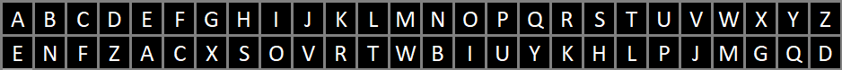

# Introduction 
As I started this project my Learning Facilitator asked me, what is a cipher and I realised I did not even know how to describe it. So I started my research on what a cipher is.

The terms cipher and encryption are often interchangeable. 

## History & Their Importance
The first cipher was created by Julius Caesar in times of war where information needed to be kept secret so that even if the enemy got their hands on the message, they would not be able to understand it. He rotated each letter of the plaintext forward by 3 places such that A became D, B became E, etc. Even now, encryption is used to secure sensitive information before it is sent over modern communication. 
An example of how important ciphers are, is when Alan Turing cracked the German's Enigma cipher, which was a significant factor leading to the German's defeat. The decryption of German communications provided the Allies with crucial information about German military plans, strategies, and activities.

- [Types of Encryption Methods](#encrypt_mtd)
  - [Substitution Ciphers](#substitution)
    - [Monoalphabetic Ciphers](#monoalphabetic)
    - [Homophonic Ciphers](#homophonic)
    - [Polygraphic Ciphers](#polygraphic)
    - [Polyalphabetic Ciphers](#Polyalphabetic)
    - [ Ciphers](#)
  - [Transposition Ciphers](#transposition)
    - [Rail Fence Cipher](#rail_fence)
    - [Scytale Cipher](#scytale)
    - [Columnar Transposition Cipher](#columnar_transposition)
    - [Matrix Transposition Cipher](#matrix_transposition)
  - [Symmetric Key Encryption](#symmetric)
  - [Asymmetric Key Encryption](#asymmetric)
  - [Hashing](#hashing)
    - [Salting](#salting)
    - [MD5](#md5)
    - [SHA](#sha)
- [Cipher Cracking](#cipher_cracking)
  - [Frequency Analysis](#freq_analysis)
  - [Pattern Recognition](#pattern_recog)
  - [Difficult to Reverse Mathematical Operations]
- [Making Ciphers Hard to Crack]
  - [Trapdoor functions]
  - [More Characters or Mapping Multiple Characters to 1 Plaintext Character]

# Types of Encryption Methods

## Substitution Ciphers 
The ciphers under this category of "substitution" replace each letter, in a way the identity of the letters changes. 

### Monoalphabetic Ciphers
Generally, a simple one-to-one mapping of letters is used. For example, each 'A' in the plaintext is replaced by the same letter in the ciphertext.

Examples include: 
#### Caesar Cipher: 
This cipher is named after the cipher Julius Caesar created. It is also known as Shift or Rotation Cipher as each letter in the plaintext is shifted or rotated forward by a fixed number of positions (also called the key) down the alphabet. For example, if the key is 3, 'A' in the plaintext would be 'D' in the ciphertext. 

#### Atbash Cipher
The earliest instances of this cipher are in the Hebrew Bible, the Book of Jeremiah. The exact reason for the usage of the cipher is not known. It could have been to protect the prophet or the later scribe, as the prophet, Jeremiah, was given the task of publically announcing Cod's punishment on the nations, which included the Babylonian empire, in Jeremiah 25. “15This is what the LORD, the God of Israel, said to me: ‘Take from my hand this cup filled with the wine of my wrath and make all the nations to whom I send you drink it. . . . 26And after all of them, the king of Sheshak will drink it too.'”

(the nations shall drink the cup of God’s wrath)

[…] and all the kings of the north, near and far, one after the other, and all the kingdoms of the world which are on the face of the earth, and the king of Sheshach shall drink after them.

The alphabet would be reversed, such that A becomes Z, etc.

#### Affine Cipher
Each letter is mapped to its numeric equivalent, multiplied by a constant, and then shifted by another constant.

For example, if a is the result, x is the numeric equivalent of the letter, y is the multiplication constant and z is the rotation constant, the formula would be:
a =  (yx + z) mod 26

### Geometric Cipher
In this category, the letters are replaced with geometric symbols.

#### Pigpen Cipher 

#### Rosicrucian Cipher 

#### Templar Cipher
The Templar Cipher is said to have been used by the Knights Templar, a group of rich warrior monks, who needed a way to encrypt their notes so that if bandits robbed travellers, the note would be useless to the bandits. For the Knights Templar, the notes told them how much money the person had stored with them. 

#### Mixed Alphabet Ciphers
Each letter is replaced by a corresponding letter from a mixed-up or randomly generated alphabet.

##### Vatsyayana Cipher
The 26 letters are paired into 13 pairs, and substitution is done using those pairs. An example of this is the one given below. 

In the example given, the letter 'A' would be substituted with 'L' and vice versa, 'B' with the letter 'P', etc.

### Homophonic Ciphers
Multiple ciphertext characters can be used to represent a single plaintext character. This introduces ambiguity and makes frequency analysis more challenging.

### Polygraphic / Block Ciphers
#### Hill Cipher 

#### Playfair Cipher (digraph cipher)

#### Polybios Square Cipher
It is named after the ancient Greek historian Polybios. Since the Greek alphabet has 25 letters, the 5x5 square was used, where the alphabet was written in a grid format. When using English letters, I and J are typically combined and given 1 space. 

### Polyalphabetic Ciphers

#### Vigenère Cipher

#### Autokey Cipher

## Transposition Ciphers
The ciphers under this category of "transposition" changes the position of the letters but the letters' "identities" do not change. For example, take the plaintext to be "Hello world!", there are 3 instances of the letter "l". The resulting ciphertext would still have 3 instances of the letter "l". 

Examples:

#### Rail Fence Cipher: (Also known as Zigzag cipher)
The plaintext is written in a zigzag pattern across a set number of rails of the fence (which are the lines) and then each line of text (each rail) is appended to the ciphertext. 

The characters would start going downwards and diagonally across the rails and at the bottom, move upwards and diagonally across. 

The cipher would read: 

Spacing is optional in the ciphertext as it would not be related to the spacing in the plaintext and would not give away any information. However, the ciphertext is split into groups of 5 using spacing so that the ciphertext is more readable. 

#### Scytale Cipher
One of the oldest known examples is the Spartan scytale, where the Ancient Greeks would wrap a ribbon around a cylindrical rod of uniform circumference before writing a message on the ribbon horizontally. The key would set the number of characters in each row. 

#### Columnar Transposition Cipher
This cipher adds a level of complexity to the scytale cipher, instead of taking the text from the left-most to the right-most columns, the order of which column to take the text from (also known as the key for this cipher) is changed. 

#### Matrix Transposition Cipher

## Symmetric Key Encryption
A single key is used to encrypt and decrypt. Symmetric keys are usually 128 or 256 bits long. The longer the key, the harder it is to crack. For example, a 128-bit key has around 340,000,000,000,000,000,000,000,000,000,000,000,000 encryption code possibilities. This makes brute force attacks more time-consuming and it becomes a less realistic approach to crack such a key.

### Data Encryption Standard (DES)

### Advanced Encryption Standard (AES)

## Asymmetric Key Encryption
Use of public-private key pairing such that data that has been encrypted with the public key can only be decrypted using the private key. The sender and recipient would have their own unique public-private key pair. As the name of the keys implies, the public key is shared openly, while the private key is kept confidential.

### Rivest–Shamir–Adleman (RSA)

### Elliptic Curve Cryptography (ECC) 

## Hashing
Meant to be a one-way encryption to secure data. 

### Salting
Adding a unique value (salt) to the data before hashing, enhances security by preventing precomputed attacks.

# Cipher Cracking
Since ciphers use 
Written below are some methods frequently used to crack or analyse ciphers. 

## Frequency Analysis
It is typically used to break substitution ciphers. 

It studies the frequency of letters or groups of letters in the ciphertext, based on the fact that in any written language, certain letters and combinations of letters occur with varying frequencies. For example in the English language, the letters E, T, A, and O are the most common. 
One would identify the most often occurring letters in the ciphertext and theorise which letters those in the ciphertext are mapped to. They may then be able to recognise patterns or words in the partially decoded text to identify more letters. 

## Pattern Recognition 
Identifying patterns in ciphertext can provide insights into the underlying structure of a substitution or transposition cipher. After a letter is discovered, the text can then be checked for possible letters after it. For example for the letter 't', 'h' is often the letter after it. 

## Mathematical Operations that are difficult to reverse 
No matrix division

# How to make cipher harder to crack
## Trapdoor functions
They refer to operations that are easy to calculate in one direction but difficult to reverse without special knowledge. 

## Introducing more characters or mapping multiple characters to a plaintext character
